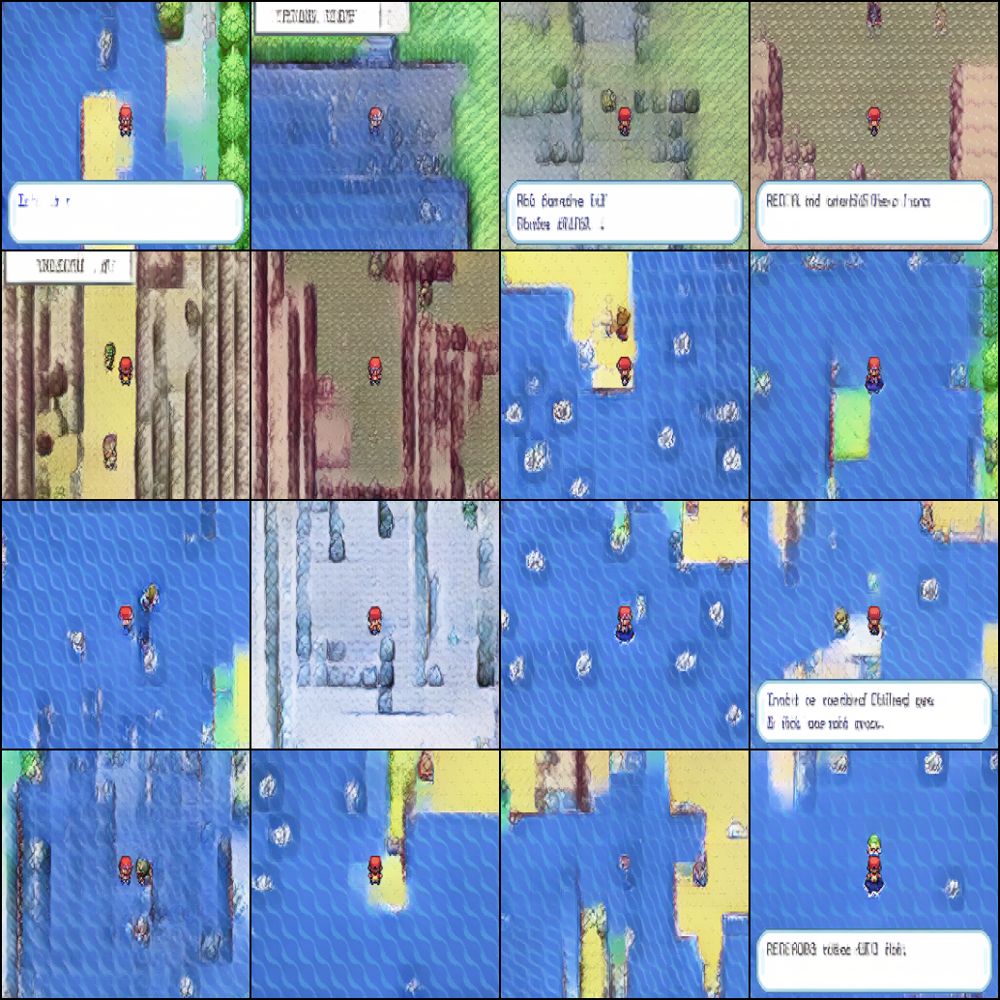
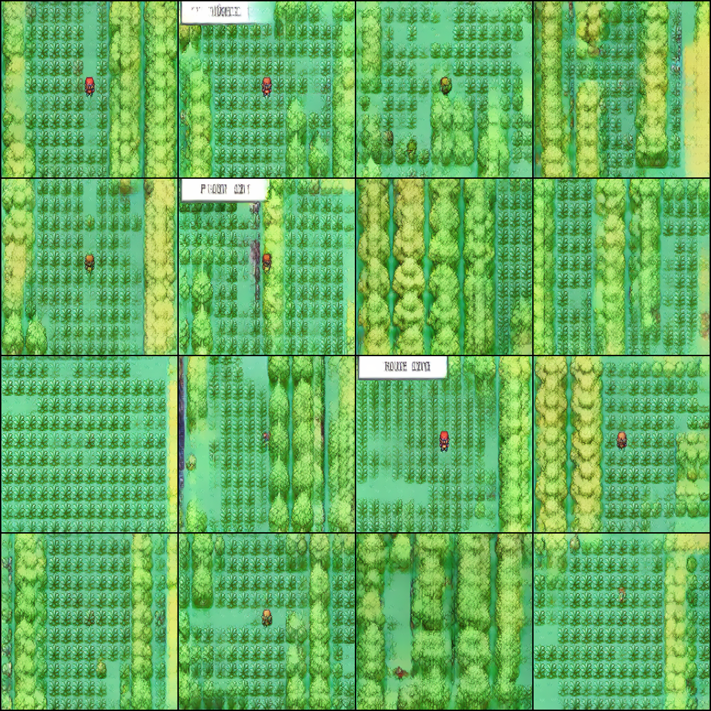
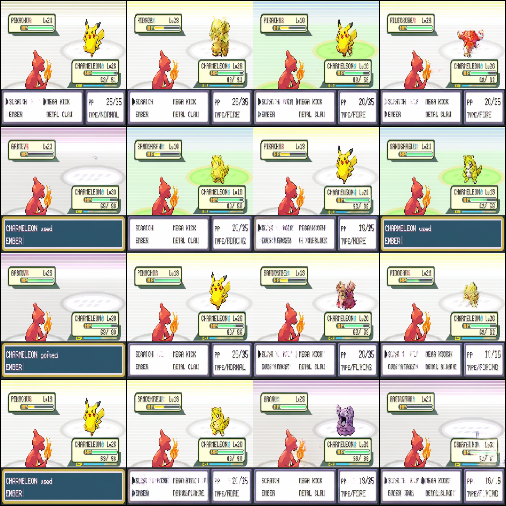
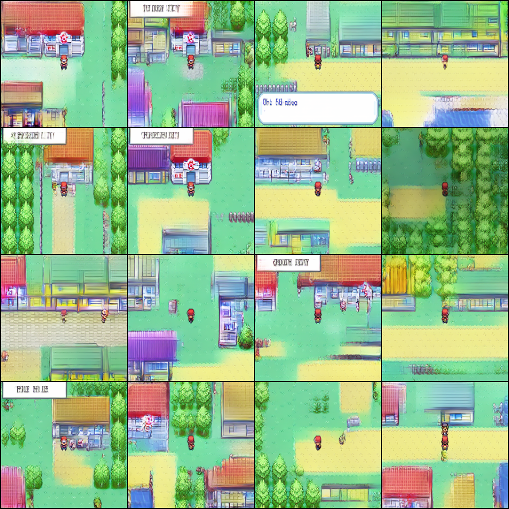

Collection of generative models trained from scratch including DDPM, DiT, VAE for learning and research

## VAE (Variational Autoncoder)

Implemented a VAE from scratch inspired by [SD-VAE](https://github.com/CompVis/stable-diffusion). It was trained on both MNIST and Minecraft images. The model uses a convolutional autoencoder with upsampling and downsampling blocks along with residual attention layers. 

Training was performed using `adversarial loss`, `KLD loss` and `LPIPS` loss using a pretrained `vgg16` network. The [vae_xl.yaml](./vae/configs/vae_xl.yaml) creates a 97.5M param VAE model.

### Training 

<div style="display: flex; gap: 1rem;">
    
    
</div>

### Interpolations

<div style="display: flex; gap: 1rem;">
    
    
</div>

### Reconstructions

The VAE was trained on `256x256` Minecraft images and outputs latents of dim `64x8x8`, with a `48x` compression.


## DiT
Implementation of Diffusion Transformer inspired by the original [DiT paper](https://arxiv.org/abs/2212.09748). The model uses transformer blocks with timesteps conditioned through `adaLN` Tested both small (76 M) and large (608 M) variants on the Minecraft dataset using our pre-trained VAE. All the models were trained on an 4x NVIDIA A100s.

<div style="display: flex; gap: 1rem; margin-bottom:1rem;">
    
    
</div> 

To train on your own dataset, modify `config.yaml` files and run:

```python
python -m vae.train_vae --config './vae/configs/vae_xl.yaml'
python -m DiT.train --config './DiT/configs/config_xl.yaml'
```

These commands will train the VAE and DiT models using the specified config files.

### Text conditioning with Classifier Free Guidance (cfg)

Experimented with text conditioning through cross-attention in the `DiTBlock` with a pre-trained `CLIP` text embedding model. 

Used [Qwen-2.5VL](https://github.com/QwenLM/Qwen3-VL) for extracting captions for ~36000 pokemon frames and trained a 1.2B parmeter DiT model with cfg and dropout. Here are some examples for selected prompts:

|  |  |
|:-----------------------------------------------:|:-----------------------------------------------:|
| *Red-haired character standing beside a **vibrant blue water body**, soft daylight, serene atmosphere* | *Red-haired character **walking through dense forest**, overcast day, pixelated art style, serene atmosphere, **lush greenery** surrounding the path* |

|  |  |
|:-----------------------------------------------:|:-----------------------------------------------:|
| *Small **orange lizard-like creature** with flames on its tail, battling with a **yellow mouse pokemon** with lightning and thunder* | *A **red-roofed healing center** in a vibrant green field, daytime, close-up, peaceful* |

All these generations were tested within a suitable cfg guidance scale of 5-20.

## DDPM Generations

<div style="display: flex; gap: 1rem;">
    
    
</div>

### Timestep sampling (T=500)

