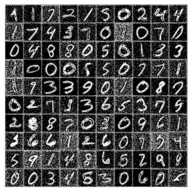
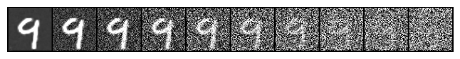

Collection of generative models trained from scratch including DDPM, DiT, VAE for learning and research

## DDPM Generations

    
    

### Timestep sampling (T=500)

## VAE (Variational Autoncoder)

Implemented a VAE from scratch inspired by [SD-VAE](https://github.com/CompVis/stable-diffusion). It was trained on both MNIST and Minecraft images. The model uses a convolutional autoencoder with upsampling and downsampling blocks along with residual attention layers. 

Training was performed using `KLD loss` and `LPIPS` loss using a pretrained `vgg16` network. The [config.yaml](vae/configs/config.yaml) creates a 64M param VAE model.

### Training 

    
    

### Interpolations

    
    

